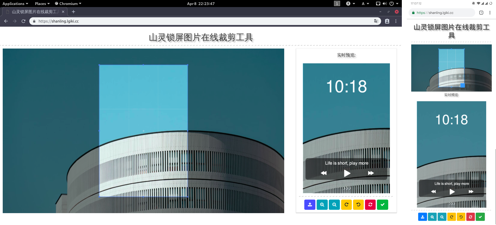

# 山灵锁屏图片在线裁剪工具
这是一个基于浏览器的山灵音乐播放器锁屏图片裁剪工具，可以上传任意图片并直接在浏览器中进行裁剪。并可实时预览锁屏效果。该工具兼容手机端浏览器。

支持山灵 M2X & M5S 锁屏图片的裁剪，裁剪完的图片分辨率为 320 * 480。

支持山灵 M0 锁屏图片的裁剪，裁剪完的图片分辨率为 240 * 240。

图片裁剪功能由 [Cropper](https://github.com/fengyuanchen/cropper) 强力驱动。

默认图片来自于 [https://www.pexels.com/photo/white-building-2058172/](https://www.pexels.com/photo/white-building-2058172/)。

# 截图
